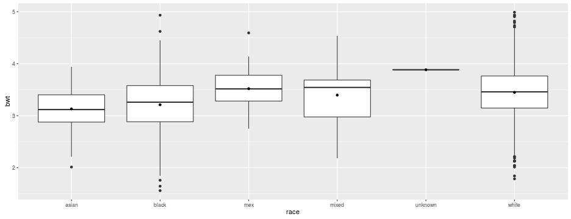
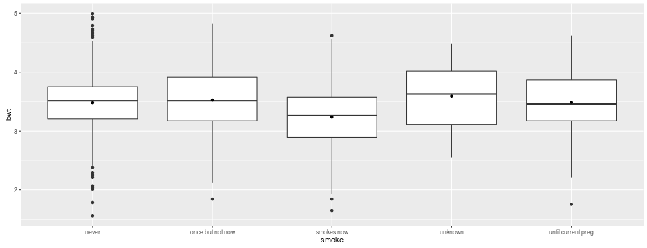
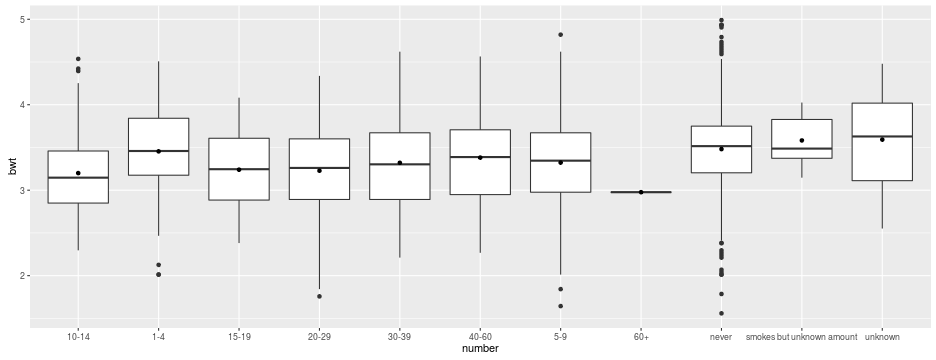

<style>
strong {
  font-weight: bold;
  color: red;
  font-size: 115%
}
</style>


--- .segue bg:grey

# Recap


---


## Recap

You should know now:
>  - the basic concept of analysis of variance
>  - the usage of the command `lm()` for analysis of variance 
>  - that `y ~ x` in R mean *y dependent on x* (formula syntax)
>  - how the visualize anova using boxplots
 

---


## Exercise

- load the babies data set using `read_excel()`:  
- the column `wt` contains the birth weight in ounces; add another column `bwt` containing the birth weight in kg
- do an one-way anova of birth weight dependent on 
  - 1. `race` (mother's race)
  - 2. `smoke` (mother's smoking status)
  - 3. `number` (number of cigs smoked per day)

- What are the percentages of explained variance in each model?
- Taken separately, which of the three variables explained most of the variance of birth weight?
- What is the mean birth weight of race mex?
- Which level of each of the three predictors has the lowest (resp. highest) mean birth weight?
- Visualize using `ggplot2`!


---


## Solution


```r
library(readxl)
babies <- read_excel("session6dta/babies.xlsx",1)
babies$bwt <- babies$wt/35.274
m1 <- lm(bwt ~ race, data = babies)
m2 <- lm(bwt ~ factor(smoke), data = babies)
m3 <- lm(bwt ~ number, data = babies)
```

---


## Solution


```r
summary(m1)
```

```
## 
## Call:
## lm(formula = bwt ~ race, data = babies)
## 
## Residuals:
##      Min       1Q   Median       3Q      Max 
## -1.66245 -0.30168  0.01017  0.32201  1.72258 
## 
## Coefficients:
##             Estimate Std. Error t value Pr(>|t|)    
## (Intercept)  3.13069    0.07640  40.977  < 2e-16 ***
## raceblack    0.07955    0.08300   0.958  0.33809    
## racemex      0.38890    0.11072   3.513  0.00046 ***
## racemixed    0.26558    0.12693   2.092  0.03661 *  
## raceunknown  0.75319    0.51251   1.470  0.14193    
## racewhite    0.31779    0.07831   4.058 5.26e-05 ***
## ---
## Signif. codes:  0 '***' 0.001 '**' 0.01 '*' 0.05 '.' 0.1 ' ' 1
## 
## Residual standard error: 0.5068 on 1218 degrees of freedom
##   (12 observations deleted due to missingness)
## Multiple R-squared:  0.04498,	Adjusted R-squared:  0.04106 
## F-statistic: 11.47 on 5 and 1218 DF,  p-value: 7.661e-11
```


---


## Solution


```r
summary(m1)$r.squared
```

```
## [1] 0.04497971
```

---


## Solution


```r
summary(m1)$r.squared
```

```
## [1] 0.04497971
```


```r
summary(m2)$r.squared
```

```
## [1] 0.05879809
```


```r
summary(m3)$r.squared
```

```
## [1] 0.04663428
```


---


## Solution


```r
library(ggplot2)
ggplot(babies, aes(x = race, y = bwt)) +
  geom_boxplot() +
  stat_summary(geom = "point", fun.y = "mean")
```




---


## Solution


```r
ggplot(babies, aes(x = smoke, y = bwt)) +
  geom_boxplot() +
  stat_summary(geom = "point", fun.y = "mean")
```



---


## Solution


```r
ggplot(babies, aes(x = number, y = bwt)) +
  geom_boxplot() +
  stat_summary(geom = "point", fun.y = "mean")
```




---


## Solution


```r
coef(summary(m1))
```

```
##               Estimate Std. Error    t value      Pr(>|t|)
## (Intercept) 3.13068601 0.07640112 40.9769674 1.993267e-231
## raceblack   0.07954547 0.08300438  0.9583285  3.380873e-01
## racemex     0.38890349 0.11071573  3.5126307  4.599375e-04
## racemixed   0.26558320 0.12692707  2.0924079  3.660861e-02
## raceunknown 0.75319447 0.51251426  1.4696069  1.419265e-01
## racewhite   0.31778537 0.07830927  4.0580812  5.262889e-05
```


--- .segue bg:grey

# Granova


---


## Granova


- install (if not already done) and load the package `granovaGG`  
- the following code produces a graphical representation of an anova analysis
- try to understand the different components


```r
library(granovaGG)
granovagg.1w(babies$bwt,babies$smoke)
```


--- .segue bg:grey

# Recoding


---


## Recoding


>  - there are different situation where it is advisable to recode variables e.g.
>    - some characteristic is coded in numbers but a level/label combination would be more appropriate
>    - one want to change a existing coding e.g. ja/nein to yes/no
>    - missing values are coded as numbers and we want to transform them into *real* missings


---


## factors

>  - a factor is a vector that contain only predefined values
>  - it is used to store categorical data
>  - the `levels()`-label combination of a factor defines the set of allowed values


```r
table(babies$sex)
```

```
## 
##   0   1 
## 626 610
```


```r
class(babies$sex)
```

```
## [1] "numeric"
```


---


## factors


```r
babies$sex.mf <- factor(babies$sex, 
                        levels = c(0,1),
                        labels = c("male","female"))
class(babies$sex.mf)
```

```
## [1] "factor"
```


```r
table(babies$sex.mf)
```

```
## 
##   male female 
##    626    610
```


---


## factors Exercise

- use `factor()` to change the `marital` and `inc` variable from numeric to factor
  - 1 = married, 2 = legally separated, 3 = divorced, 4 = widowed, 5 = never married
  - 0 = <2500, 1 = 2500-4999, 2 = 5000-7499, 3 = 7500-9999, ..., 9 = 15000+, 98 = unknown, 99 = not asked
- table the two variables using `table()` and `prop.table()`; what is the percentage of <2500 amongst married and what amongst never married?


---


## Solution


```r
babies$marital <- factor(babies$marital, 
                         levels = 1:5, 
                         labels = c("married","legally separated",
                                    "divorced","widowed","never married"))
babies$inc <- factor(babies$inc,
                     levels = c(0:9,98,99),
                     labels = c("<2500",
                                paste(seq(2500,20000,by = 2500),
                                      seq(4999,22500,by = 2500),sep = "-"),
                                "25000+","unknown","not asked"))
```


---


## Solution

```r
addmargins(prop.table(table(babies$inc,babies$marital),2))
```

```
##              
##                  married legally separated   divorced widowed
##   <2500       0.02400662        0.06666667 0.00000000        
##   2500-4999   0.15397351        0.26666667 0.40000000        
##   5000-7499   0.14486755        0.06666667 0.20000000        
##   7500-9999   0.14900662        0.00000000 0.00000000        
##   10000-12499 0.11341060        0.06666667 0.00000000        
##   12500-14999 0.10264901        0.13333333 0.00000000        
##   15000-17499 0.05877483        0.06666667 0.00000000        
##   17500-19999 0.11672185        0.06666667 0.20000000        
##   20000-22499 0.02069536        0.00000000 0.00000000        
##   25000+      0.01738411        0.06666667 0.20000000        
##   unknown     0.09850993        0.20000000 0.00000000        
##   not asked   0.00000000        0.00000000 0.00000000        
##   Sum         1.00000000        1.00000000 1.00000000        
##              
##               never married Sum
##   <2500          0.16666667    
##   2500-4999      0.50000000    
##   5000-7499      0.00000000    
##   7500-9999      0.00000000    
##   10000-12499    0.00000000    
##   12500-14999    0.00000000    
##   15000-17499    0.00000000    
##   17500-19999    0.00000000    
##   20000-22499    0.00000000    
##   25000+         0.00000000    
##   unknown        0.33333333    
##   not asked      0.00000000    
##   Sum            1.00000000
```


---


## change labels


```r
babies$sex.jm <- factor(babies$sex.mf, 
                        levels = c("male","female"),
                        labels = c("Junge","Maedchen"))
table(babies$sex.jm)
```

```
## 
##    Junge Maedchen 
##        0     1236
```


---


## recoding

>  - another kind of issue is a problem like the following:
>  - the `drace` variable contains 11+ races plus one unknown coding
>  - coding 0-5 means all white, 6 mex, 7 black, 8 asian, 9 and 10 mixed, 99 unknown


```r
library(car)
babies$drace <- recode(babies$drace,
                       '0:5="white";6="mex";7="black";
                       8="asian";c(9,10)="mixed";99=NA')
```


---


## Exercise

- use the variables `race` and `drace` to get the percentage of mixed paires (man and woman from different races)


---


## Solution


```r
prop.table(table(babies$race == babies$drace))
```

```
## 
##      FALSE       TRUE 
## 0.05660377 0.94339623
```

